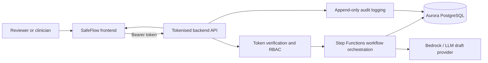

# SafeFlow Architecture Options

> Readiness note: this document describes a mock/readiness direction only. It is for planning, review and shared vocabulary. It does not imply a live AWS deployment, does not wire AWS SDK calls into this repo, and does not depend on `SAFEFLOW_DEPLOYMENT_APPROVED`.

Related control-board entry: `CONTROL.md` SF-104.

## Option A: Static Simulation Prototype

Use now.

Shape:

- Vite React app.
- Local fictional data.
- Deterministic rule logic.
- No backend.
- No authentication.
- No live integrations.

Best for:

- Demonstrations.
- Early stakeholder feedback.
- UI flow validation.
- Public-safe sharing.

Limitations:

- No persistence.
- No real users or roles.
- No real audit store.
- No integration pathway.

## Option B: Secure Pilot Application

Recommended next target.

Shape:

- React frontend.
- Tokenised backend API that verifies bearer tokens from Cognito or another approved identity provider.
- Role-based access control enforced server-side from token claims.
- Step Functions orchestrates multi-step workflow actions such as draft request, review, save and export.
- Aurora PostgreSQL stores workflow state, audit events, draft notes and relational workspace data.
- A server-side `DraftProvider` interface can call a Bedrock/LLM layer for wording assistance and draft generation.
- CloudWatch, KMS, Secrets Manager and S3 support logs, encryption, secrets and exports.
- This is a readiness model only. No live AWS deployment or SDK wiring is included in the repo.

Best for:

- Simulation workshops.
- Safety-case development.
- Product validation.
- Procurement and partner conversations.

Request flow:

Notes:

- The audit path stays append-only and reviewable.
- AI draft generation stays behind the server-side provider interface.
- The diagram is a planning aid, not a deployment recipe.

Key decisions:

- Identity provider.
- Token format and claim mapping.
- Exact workflow states.
- Audit event schema.
- Whether the Bedrock layer is direct or wrapped by a provider service.
- Retention and access controls for audit data.

## Option C: Integrated Clinical System

Use only after evidence, safety and governance gates.

Shape:

- Read-only clinical data integrations.
- Role-based access tied to organisational identity.
- Clinical safety case.
- Information-governance approval.
- Operational support model.
- Monitoring, incident response and release controls.

Best for:

- Controlled pilot with real clinical workflows.

Risks:

- Integration complexity.
- Patient-identifiable data handling.
- Clinical safety obligations.
- Alert fatigue.
- Overreliance on AI output.

## Recommended Path

Move from A to B first. Do not jump directly from the static prototype to an integrated clinical system.

The next meaningful milestone is a documented, readiness-only AWS pilot shape using synthetic or de-identified data, with tokenised auth, RBAC, audit logging, Aurora persistence, Step Functions orchestration and a Bedrock/LLM draft provider behind a server-side interface.
